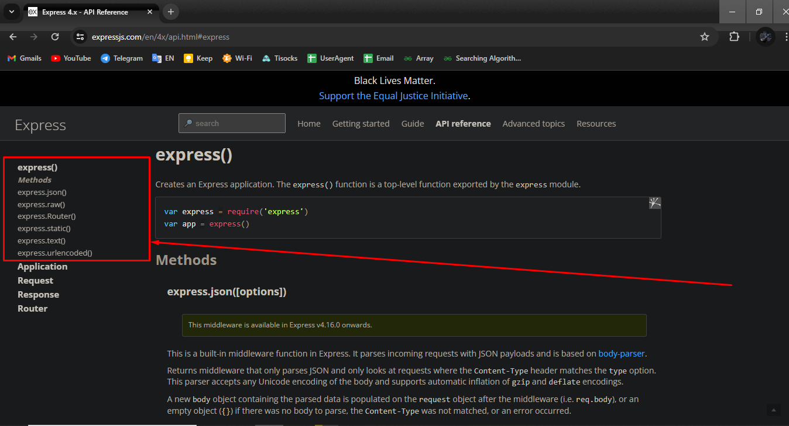

# Express 101

## Table of Contents

- [Create A Fresh Project](#create-a-fresh-project)
- [Explore Express Methods](#explore-express-methods)
- [Explore Application Object](#explore-application-object)
- [Understand Request](#understand-request)
- [Understand Response](#understand-response)
- [Middleware Pipeline](#middleware-pipeline)

## Create A Fresh Project

Go to your terminal and run the following command.

```
npm init -y

```

After that, create an "index.js" file in root directory. Go to the "package.json" file and update "script" section like the below:

```
"scripts": {
    "start": "node index.js"
  },
```

Now if go to terminal and run "npm start" then the project will run. Note that "run" prefixer is not required for "npm start" and "npm test" but it's required for "dev" and others command. Project's basic structure is ready. Now setup express application.

### Setup Express Application

To install express, run the following command.

```
npm i express
```

We will write down the Node version we are using in the "package.json" file. How to check node version?

```
node -v
```

In "package.json" file, write down the Node version like the below:

```
"engines": {
    "node": "20.11.0"
  }
```

Now go to "index.js" file and setup express application.

1. Import express (old style and this is called common js module system).

```
const express = require("express");
// import express from "express"; (new style and this is called ecmascript module system)
```

2. Create the desire application using express function call.

```
const app = express();
```

3. Now we need to listen this application.

```
app.listen(4000, () => {
  console.log("Server is listening on PORT 4000");
});
```

Our application is ready.
Full code of 'index.js' file

```
const express = require("express");

const app = express();

app.listen(4000, () => {
  console.log("Server is listening on PORT 4000");
});
```

### Send HTML to Browser

If you change any code, restart the server must (as we not yet use "nodemon")

1. Handle route ( app.get(route, controller) )

```
// index.js

app.get("/", (req, res) => {
  res.send(`
  <!DOCTYPE html>
  <html lang="en">
    <head>
      <meta charset="UTF-8" />
      <meta name="viewport" content="width=device-width, initial-scale=1.0" />
      <title>NodeJS 101 Course</title>
      <style>
        * {
          margin: 0;
          padding: 0;
          box-sizing: border-box;
        }
        body {
          font-family: Arial, Helvetica, sans-serif;
          font-size: 16px;
        }
        .container {
          width: 50%;
          margin: 2rem auto;
          padding: 2rem;
          background: #dddeee;
        }
        .text{
            margin-top: 0.5rem
        }
      </style>
    </head>
    <body class="container">
      <h1>Hello NodeJS, You are Really Awesome!</h1>
      <p class="text">
        Lorem ipsum dolor sit amet consectetur adipisicing elit. Veniam, mollitia!
        Numquam, ipsa, velit voluptatibus reiciendis totam excepturi molestiae
        nesciunt ullam quae soluta modi quo, pariatur aperiam perspiciatis quasi
        dolore nam.
      </p>
    </body>
  </html>
  `);
});
```

### Understand The Pipeline


Every route needs a handler function. Handler function's signature is -

```
// It could be an arrow function.

function handler(req, res, next) {
  // read request object
  // process request
  // response back the result
}
```

### Install Nodemon

```
npm i -D nodemon
```

--save-dev ( sort form is '-D' )

This is not a dependency of the project, it is developer dependency. That's why we use "-D" for developer dependency. It'll save as dev dependency. When the production build is done, dev dependencies will be removed to reduce the file size. There will only be application dependencies required.

Add a new script inside package.json file ( "dev" is added ).

```
"scripts": {
    "start": "node index.js",
    "dev": "nodemon index.js"
  },
```

Now we must write in terminal "npm run dev" not "npm dev". Now no need to restart the server if you change any code.

### Handle Multiple Routes

```
// index.js

app.get('/', (req,res)=>{
  res.send(`<h1>I am Home Route</h1>`)
})

app.get('/about', (req,res)=>{
  res.send(`<h1>I am About Route</h1>`)
})

app.get('/help', (req,res)=>{
  res.send(`<h1>I am Help Route</h1>`)
})
```

### Send HTML File

Create a file named 'pages' in the root directory and create a folder named 'index.html' inside it.

```
// pages/index.html

<!DOCTYPE html>
<html lang="en">
  <head>
    <meta charset="UTF-8" />
    <meta name="viewport" content="width=device-width, initial-scale=1.0" />
    <title>HTML Coming from File</title>
  </head>
  <body>
    <h1>HTML Coming from File</h1>
    <p>
      Lorem ipsum dolor sit amet, consectetur adipisicing elit. Ad adipisci
      nesciunt cumque sint quam quae repellat perferendis, aliquam accusamus
      voluptates exercitationem aperiam molestiae a, itaque natus quaerat
      mollitia tenetur repudiandae!
    </p>
  </body>
</html>
```

To send this HTML file, go to 'index.js' file and import 'fs' module.

```
const fs = require("fs");

app.get("/htmlfile", (req, res) => {
  fs.readFile("./pages/index.html", (err, data) => {
    if (err) {
      console.log("Error ", err);
      res.send(`<h1>Something Went Wrong</h1>`);
    } else {
      res.write(data);
      res.end();
    }
  });
});
```

By doing this, our first module is completed successfully.

## Explore Express Methods

### Important Express Methods:

- express.json()
- express.Router()
- express.static()
- express.urlencoded()

Read [express methods](https://expressjs.com/en/5x/api.html#express) documentation to gain details knowledge.



## Explore Application Object

### Important Application Object:

- app.get()
- app.post()
- app.put()
- app.delete()
- app.listen()
- app.use()
- app.route()

Read [express application](https://expressjs.com/en/5x/api.html#app) documentation to gain details knowledge.


## Understand Request

### Important Request Object:

Properties

- req.body
- req.cookies (It's needed to work with authentication.)
- req.params (It's important for dynamic routing.)
- req.query
- req.hostname
- req.ip
- req.method

Methods

- req.accepts()
- req.get()

Read [express request object](https://expressjs.com/en/5x/api.html#req) documentation to gain details knowledge.


## Understand Response

### Important Response Object

Methods

- res.append()
- res.attachment()
- res.cookie()
- res.download()
- res.json()
- res.jsonp()
- res.send()
- res.redirect()
- res.render()
- res.get()
- res.set()
- res.send()
- res.sendFile()
- res.status()
- res.sendStatus()
- res.format()
- res.end()

Read [express request object](https://expressjs.com/en/5x/api.html#res) documentation to gain details knowledge.


## Middleware Pipeline

Another important concept like request and response is middleware. With its help we do the most important things. We can use middleware anywhere. If we are only working with request and response, we can do almost all the task.

#### Then why do we use Middleware?

When we say we need a separate handler for each task, it means that we will have some tasks that are very common and the tasks we need to do for each request. In this case if we can use middleware then we can complete these repetitive tasks in a specific place, but if we don't use middleware we have to write duplicate codes continuously. That's why we use middleware.


### Responsibility of A Middleware

- handle common task
- log requests
- filter request
- modify or reshape request
- validate request body
- authenticate or authorize request
- add additional details to request body
- response bad requests
- pass requests to next middleware or response handler

### How to Use A Middleware

We can use middleware like the below:

```
app.use(express.json())
app.use(express.urlencoded({extended: true}))
```

**`app.use`** is used to register a middleware.

We can get data from json body or request body using **`app.use(express.json())`**. We can get data from multi page's form using **`app.use(express.urlencoded({extended: true}))`**.

Let's install some third-party middleware.

```
npm i morgan cors
```

**`morgan`** is a logger middleware.
**`cors`** is a cross origin resource sharing middleware.

```
const cors = require("cors");
const morgan = require("morgan");

app.use(morgan("dev"));
app.use(cors());
```

We are using these middleware within the application, so they are global middleware. We also can use them as route specific middleware like the below:

```
app.get("/about", cors(), (req, res) => {
  res.send(`<h1>I am About Route</h1>`);
});
```

In this case, **`cors()`** will work only for this "/about" route. We can use here multiple middleware via an array like the below:

```
app.get("/about", [cors(), morgan('dev')], (req, res) => {
  res.send(`<h1>I am About Route</h1>`);
});
```

### Signature of A Middleware

Middleware and Controller have the same signature but their responsibilities differ. Middleware checks everything and passes the request to the next middleware or controller. Then the controller generates and submits the actual response by writing business logic.

```
// If everything seems ok, controller will call response methods.
// If everything seems ok, middleware will call next methods.

function controllerSignature(req, res, next) {
  // read request object
  // process request
  // response back the result
}


function middlewareSignature(req, res, next) {

  next();
}
```

### Create Custom Middleware

#### Global Middleware

```
function globalMiddleware(req, res, next) {
  console.log("I'm a global middleware");
  next();
}
```

Let's register it.

```
app.use(globalMiddleware);
```

We don't need to call the globalMiddleware function because we maintained the middleware signature when we created the globalMiddleware. Note that, if we don't call the next() methods, this middleware will not generate any response.

#### Local Middleware

```
function localMiddleware(req, res, next) {
  console.log("I'm a local middleware");
  next();
}
```

Let's use it into about route

```
app.get("/about", localMiddleware, (req, res) => {
  res.send(`<h1>I am About Route</h1>`);
});
```

## Understand Router

### Important Router Methods

- router.all()
- router.route() (for grouping)
- router.use() (for large application)

Read [express router]() documentation to gain details knowledge.


Firstly Router ke amader baire ber kore ante hobe, tar jonne amra express theke directly Router function ke call korte pari like the below:

```
const express = require("express");

const router = express.Router();
```

akhon amra **`app.get`** er bodole **`router.get`** use korte pari.

```
router.get("/", (req, res) => {
  res.send(`<h1>I am Home Route</h1>`);
});
```

akon amra amader application take run korle error dekhbo, karon holo amra application er sathe eta use korini, amra router er sathe routing ta use koreci, jar fole amader application ee kuno route pacce na, so router basically akta middleware, amra jehetu router express theke ber kore alada vabe ata configure koreci, amader uchit hobe amader application janiye dewa je vai ami ai middleware ta use korecilam.

```
app.use(router);
```

akhon application take run korle sob thik thak vabe cholbe. ai theory ta use kore amra alada file ee routing handle korte pari.

**Enough knowledge amra gain koreci, it's time to practical task**

## Separate Router File

Let's create a separate router file in root directory named **`routes.js`**. ai file ei akhon theke router related sokol kaj kora hobe like router modify kora, new new router add kora. akhon ai file ee router take ber kore ani

```
const router = require("express").Router();
```

router gulo ke jeno onno file theke use korte pari tar jonne router take export korbo like the below:

```
module.exports = router;
```

amader project er sob router ke ai file ee niye asi

```
const router = require("express").Router();

router.get("/", (req, res) => {
  res.send(`<h1>I am Home Route</h1>`);
});

router.get("/about", localMiddleware, (req, res) => {
  res.send(`<h1>I am About Route</h1>`);
});

router.get("/help", (req, res) => {
  res.send(`<h1>I am Help Route</h1>`);
});

module.exports = router;
```

and ai file take main file ee import kori like the below:

```
app.use(require("./routes"));
```
